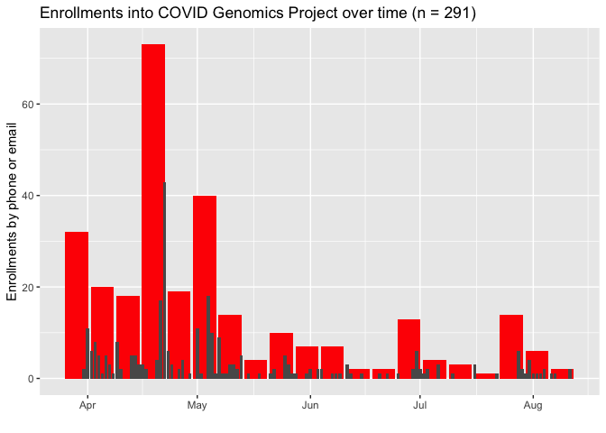

Enrollment Covid Genomics Study
================
Chris LeBoa
2020-08-18

``` r
# Libraries
library(tidyverse)
library(RCurl)
library(lubridate)
# Parameters


#===============================================================================

# Code
```

\#API Export

``` r
enrollment_data_raw <- postForm(
  uri='https://redcap.stanford.edu/api/',
  token='0AF77C06732E8B075AB460C3C45F8C73',
  content='report',
  format='csv',
  report_id='67911',
  csvDelimiter='',
  rawOrLabel='raw',
  rawOrLabelHeaders='raw',
  exportCheckboxLabel='false',
  returnFormat='csv'
)
```

\#Read in data

``` r
enrollment_data <-  
  read_csv(enrollment_data_raw)
```

\#Data Cleaning

``` r
#enrollment_data_formatted <-
  enrollment_data %>% 
  mutate(
    consent = case_when(
      consent == 1 | econsent == 1 ~ 1, 
      TRUE ~ 0
    ),
    enrollment_date = case_when(
      !is.na(interview_date) ~ interview_date, 
      !is.na(consent_template_timestamp) ~ as_date(ymd_hms(consent_template_timestamp))
    ), 
    enrollment_week = floor_date(enrollment_date, "week")
  ) %>% 
  ggplot() +
  geom_bar(aes(x = enrollment_week), fill = "red") + 
  geom_bar(aes(x = enrollment_date)) + 
  labs(
    title = "Enrollments into COVID Genomics Project over time (n = 291)",
    y = "Enrollments by phone or email", 
    x = "", 
    source = "Updated 08/04/2020"
  )
```

    ## Warning: 7 failed to parse.

    ## Warning: Removed 1959 rows containing non-finite values (stat_count).
    
    ## Warning: Removed 1959 rows containing non-finite values (stat_count).

<!-- -->

``` r
enrollment_data %>% 
  mutate(r = ymd_hms(consent_template_timestamp), 
         r = as_date(r)) %>% 
  select(r)
```

    ## Warning: 7 failed to parse.

    ## # A tibble: 2,250 x 1
    ##    r         
    ##    <date>    
    ##  1 NA        
    ##  2 2020-08-07
    ##  3 2020-04-29
    ##  4 2020-04-22
    ##  5 NA        
    ##  6 NA        
    ##  7 2020-04-22
    ##  8 2020-04-22
    ##  9 NA        
    ## 10 NA        
    ## # … with 2,240 more rows
